# UML Class Diagram (Vertical Layout & Colorful)

This contains the complete UML Class Diagram for the **FitAura** project, represented in Mermaid syntax.

- **Methods & Operations**: Realistic CRUD, validation, search, payment, and chat methods have been added to all classes.
- **Vertical Orientation**: Using `direction TB` to enforce a vertical (portrait) layout rather than a wide horizontal layout.
- **Colorful Styling**: Renders using Mermaid's default colorful theme.

```mermaid
classDiagram
    direction TB

    %% ==========================================
    %% Entity Definitions (Classes with Methods)
    %% ==========================================

    class usertypes {
        +int usertype_id
        +string role
        +createRole() bool
        +getRole() string
    }

    class users {
        +int user_id
        +int usertype_id
        +string name
        +string email
        +string password
        +string address
        +string contact_number
        +string gender
        +string cnic
        +int has_access
        +string profile_picture
        +timestamp created_at
        +timestamp updated_at
        +register() bool
        +login(string email, string password) bool
        +updateProfile() bool
        +resetPassword() bool
        +toggleAccess() bool
    }

    class store {
        +int store_id
        +int owner_id
        +string store_name
        +blob logo
        +string bio
        +string website
        +int has_access
        +decimal overall_rating
        +string instagram
        +timestamp created_at
        +timestamp updated_at
        +createStore() bool
        +updateDetails() bool
        +toggleStatus() bool
        +calculateOverallRating() decimal
    }

    class products {
        +int product_id
        +int store_id
        +string product_name
        +string description
        +string category
        +string gender
        +decimal price
        +string product_images
        +int is_verified
        +int is_visible
        +timestamp created_at
        +timestamp updated_at
        +addProduct() bool
        +updateProduct() bool
        +deleteProduct() bool
        +toggleVisibility() bool
        +verifyProduct() bool
    }

    class product_variants {
        +int variant_id
        +int product_id
        +string size
        +string color
        +decimal price_per_variant
        +int stock_quantity
        +int is_active
        +timestamp created_at
        +timestamp updated_at
        +addVariant() bool
        +updateStock(int quantity) bool
        +toggleVariantStatus() bool
    }

    class order_items {
        +int order_item_id
        +int order_id
        +int product_id
        +int variant_id
        +string product_name
        +decimal price
        +int quantity
        +string size
        +string color
        +addItemToOrder() bool
        +calculateItemTotal() decimal
    }

    class cart {
        +int cartitemid
        +int userId
        +int productid
        +int quantity
        +string size
        +string color
        +timestamp addedAt
        +addToCart() bool
        +updateQuantity(int newQty) bool
        +removeFromCart() bool
        +clearCart() bool
    }

    class orders {
        +int order_id
        +int customer_id
        +string shipping_address
        +string contact_number
        +string shipping_type
        +string payment_method
        +decimal total_price
        +string order_status
        +timestamp created_at
        +timestamp updated_at
        +createOrder() bool
        +cancelOrder() bool
        +updateStatus(string status) bool
        +calculateTotal() decimal
    }

    class PAYMENT {
        +int Payment_id
        +int Customer_id
        +int order_id
        +string Payment_Status
        +decimal Amount
        +processPayment() bool
        +refundPayment() bool
        +getPaymentStatus() string
    }

    class REVIEWS {
        +int Review_id
        +int product_id
        +int order_id
        +int customer_id
        +int Rating
        +string comment
        +timestamp timestamp
        +addReview() bool
        +deleteReview() bool
        +getAverageRating(int productId) decimal
    }

    class user_interactions {
        +int interaction_id
        +int user_id
        +int product_id
        +string interaction_type
        +string search_query
        +timestamp timestamp
        +logInteraction() bool
        +getInteractions(int userId) List
    }

    class promotions {
        +int promotion_id
        +int store_id
        +string title
        +decimal discount
        +date start_date
        +date end_date
        +timestamp created_at
        +int status
        +createPromotion() bool
        +updatePromotion() bool
        +expirePromotion() bool
    }

    class promotion_products {
        +int promotion_id
        +int product_id
        +linkProductToPromotion() bool
        +removeProductFromPromotion() bool
    }

    class MESSAGES {
        +int Message_id
        +int sender_id
        +int receiver_id
        +string Message_
        +int Is_read
        +timestamp Created_at
        +sendMessage() bool
        +markAsRead() bool
        +deleteMessage() bool
    }

    class CHAT_SYSTEM {
        +int Chat_id
        +int Person_One
        +int Person_Two
        +int Is_Active
        +timestamp Created_At
        +initializeChat() bool
        +closeChat() bool
        +getChatHistory() List
    }

    class notifications {
        +int notification_id
        +int user_id
        +string title
        +string message
        +int is_read
        +timestamp created_at
        +sendNotification() bool
        +markAsRead() bool
    }

    class Search_History {
        +int SearchHistory_Id
        +int User_Id
        +string Search_Query
        +string ClickedProduct_Category
        +int ClickedProduct_Id
        +saveSearch() bool
        +clearSearchHistory() bool
    }

    class WALLET {
        +int wallet_id
        +int user_id
        +decimal balance
        +addFunds(decimal amount) bool
        +deductFunds(decimal amount) bool
        +getBalance() decimal
    }

    class wallet_store_credit {
        +int wallet_store_credit_id
        +int user_id
        +int store_id
        +decimal balance
        +issueCredit(decimal amount) bool
        +redeemCredit(decimal amount) bool
        +getCreditBalance() decimal
    }

    class complaints {
        +int complaint_id
        +int order_id
        +int product_id
        +int store_id
        +int user_id
        +string status
        +string type
        +string issue
        +string description
        +string images
        +string admin_decision
        +string admin_verification
        +string admin_comment
        +decimal refund_amount
        +timestamp created_at
        +fileComplaint() bool
        +updateComplaintStatus(string newStatus) bool
        +processRefund(decimal amount) bool
        +adminReviewComment(string comment) bool
    }

    %% ==========================================
    %% Relationship Definitions
    %% ==========================================

    usertypes "1" --> "0..*" users : "user has type"
    users "1" --> "0..*" store : "seller creates store"
    store "1" --> "0..*" products : "store has products"
    products "1" --> "0..*" product_variants : "product has multiple variants"
    users "1" --> "0..*" orders : "customer places order"
    orders "1" --> "1..*" order_items : "order has multiple items"
    products "1" --> "0..*" order_items : "product appears in"
    product_variants "0..1" --> "0..*" order_items : "variant appears in"
    users "1" --> "0..*" cart : "user has a cart"
    products "1" --> "0..*" cart : "product appears in cart"
    users "1" --> "0..*" PAYMENT : "customer does payment"
    orders "1" --> "0..1" PAYMENT : "payment for order"
    users "1" --> "0..*" REVIEWS : "customer writes reviews"
    products "1" --> "0..*" REVIEWS : "product has reviews"
    orders "0..1" --> "0..*" REVIEWS : "order has reviews"
    users "1" --> "0..*" user_interactions : "user will interact by searching"
    products "1" --> "0..*" user_interactions : "user will interact by searching"
    store "1" --> "0..*" promotions : "seller creates promotion"
    promotions "1" --> "0..*" promotion_products : "promotion will have promotion products"
    products "1" --> "0..*" promotion_products : "promotion will have promotion products"
    users "1" --> "0..*" MESSAGES : "user sends messages (sender_id)"
    users "1" --> "0..*" MESSAGES : "user receives messages (receiver_id)"
    users "1" --> "0..*" CHAT_SYSTEM : "user has chats (Person_One)"
    users "1" --> "0..*" CHAT_SYSTEM : "user has chats (Person_Two)"
    CHAT_SYSTEM "1" --> "0..*" MESSAGES : "chat has messages"
    users "1" --> "0..*" notifications : "user receives notifications"
    users "1" --> "0..*" Search_History : "user has search history"
    users "1" --> "0..1" WALLET : "user has wallet"
    WALLET "1" --> "0..*" wallet_store_credit : "wallet has wallet store credits"
    users "1" --> "0..*" wallet_store_credit : "user has wallet store credits"
    store "1" --> "0..*" wallet_store_credit : "store has wallet store credits"
    users "1" --> "0..*" complaints : "user files complaints"
    orders "1" --> "0..*" complaints : "order has complaints"
    products "1" --> "0..*" complaints : "product has complaints"
    store "1" --> "0..*" complaints : "store has complaints"
```

